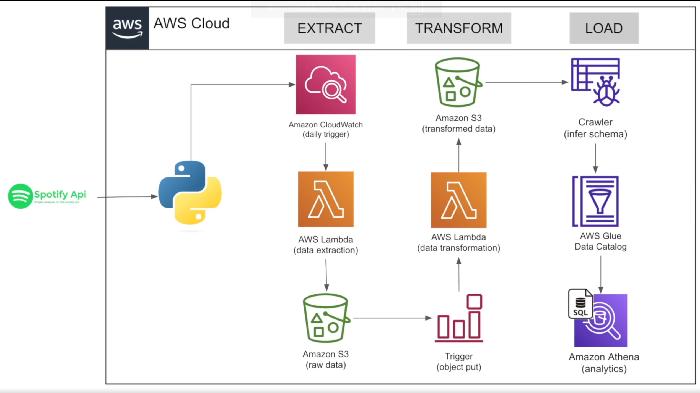

# 🎵 Spotify Data Pipeline with Snowpipe & Snowflake on AWS

An end-to-end, serverless data engineering pipeline that extracts Spotify playlist data through the Spotify Web API, stores raw data in Amazon S3, automatically transforms it using AWS Lambda, and loads curated datasets into Snowflake using Snowpipe for analytics.

---

## 🚀 Project Overview

This project demonstrates how to build a production-style ETL pipeline using AWS serverless services and Snowflake.

The pipeline is fully automated and event-driven.

### Workflow

1. Amazon CloudWatch triggers the extraction Lambda daily.
2. Lambda authenticates with the Spotify API.
3. Raw playlist data is stored in Amazon S3.
4. Uploading a raw JSON file triggers a second Lambda.
5. Lambda transforms the raw JSON into analytical tables.
6. Clean datasets are stored back into Amazon S3.
7. Snowpipe automatically loads new files into Snowflake.
8. Data becomes immediately available for SQL analytics and dashboards.

---

# 🏗️ Architecture

<p align="center">

</p>

---

# ⚙️ Tech Stack

| Category | Technology |
|-----------|------------|
| Language | Python |
| API | Spotify Web API |
| Cloud | AWS |
| Storage | Amazon S3 |
| Scheduling | Amazon CloudWatch |
| Compute | AWS Lambda |
| Event Trigger | Amazon S3 Object Created |
| Data Warehouse | Snowflake |
| Auto Ingestion | Snowpipe |
| Analytics | SQL |
| Version Control | Git & GitHub |

---

# 📊 Data Pipeline

## Step 1 — Extract

Amazon CloudWatch triggers an AWS Lambda function once per day.

The Lambda function:

- Authenticates with Spotify
- Retrieves playlist information
- Downloads track metadata
- Saves raw JSON to Amazon S3

Example:

```
Spotify API
      ↓
Lambda
      ↓
s3://spotify-data/raw/
```

---

## Step 2 — Transform

An S3 Object Created event automatically invokes a second Lambda.

The transformation Lambda:

- Reads raw JSON
- Cleans nested structures
- Removes unnecessary fields
- Creates analytical datasets

Output tables include:

- Albums
- Artists
- Songs

Example:

```
Raw JSON
      ↓
Lambda
      ↓
Album.csv
Artist.csv
Song.csv
```

Saved to

```
s3://spotify-data/transformed/
```

---

## Step 3 — Load

Snowpipe continuously monitors the transformed S3 bucket.

Whenever a new file arrives:

- Snowpipe automatically loads data
- No manual COPY command required
- Data becomes available inside Snowflake

---

# 📋 Data Model

### Album Table

| Column |
|----------|
| album_id |
| album_name |
| release_date |
| total_tracks |
| url |

---

### Artist Table

| Column |
|----------|
| artist_id |
| artist_name |
| external_url |

---

### Song Table

| Column |
|----------|
| song_id |
| song_name |
| duration_ms |
| popularity |
| explicit |
| album_id |
| artist_id |

---

# 🔄 Event Driven Workflow

```
CloudWatch
      ↓
Extract Lambda
      ↓
Raw JSON
      ↓
Amazon S3
      ↓
S3 Trigger
      ↓
Transform Lambda
      ↓
Amazon S3 (Transformed)
      ↓
Snowpipe
      ↓
Snowflake
```

---

# 🔒 Environment Variables

Create a `.env` file.

```
SPOTIPY_CLIENT_ID=YOUR_CLIENT_ID
SPOTIPY_CLIENT_SECRET=YOUR_CLIENT_SECRET
REDIRECT_URI=http://127.0.0.1:9090/callback
```

---

# 📈 Skills Demonstrated

- Python
- REST APIs
- JSON Processing
- ETL Pipeline Design
- Event-Driven Architecture
- AWS Lambda
- Amazon S3
- CloudWatch Events
- Snowflake
- Snowpipe
- SQL
- Data Modeling
- Git
- GitHub

---

# 👨‍💻 Author

**Jason Tonogbanua**

Data Engineering Portfolio Project

Built using Python, AWS, Snowflake, and the Spotify Web API.
